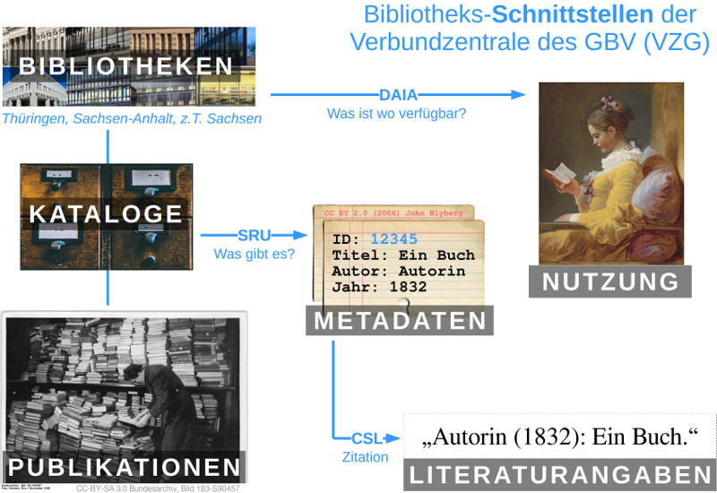

# Bibliotheks-APIs der Verbundzentrale des GBV (VZG)

Im Rahmen des Hackathons [Coding da Vinci Ost](https://codingdavinci.de/events/ost/)
sollen ausgewählte Schnittstellen zu Bibliothekssystemen vorgestellt werden.

*Weiter Informationen siehe unter <https://verbundwiki.gbv.de/display/VZGVers/Coding+da+Vinci>*

## Beschreibung der Daten

Bibliothekskataloge verzeichnen Bücher, Zeitschriften und andere Medien mit
bibliographischen Angaben (Titel, Autor, Jahr...) und Exemplardaten (Standort,
Signatur, Verfügbarkeit...). Die Verbundzentrale des GBV stellt einheitliche
Schnittstellen zum Zugriff auf Kataloge von mehreren Hundert Bibliotheken
bereit, darunter alle Hochschulbibliotheken der GBV-Mitglieder Thüringen und
Sachsen-Anhalt. Für Sächsische Bibliotheken gibt es teilweise entsprechende
Schnittstellen. Konkret können Bibliothekskataloge per SRU-API durchsucht
werden (beispielsweise Suche nach einer ISBN oder nach allen Veröffentlichungen
eines Autors) und per DAIA-API ermittelt werden, welche Exemplare eines Titels
verfügbar oder ausgeliehen sind.

## Rechteangaben und Lizenzen

Die Metadaten können frei weitergenutzt werden (CC0). Sie können allerdings
Verweise auf unfreie Cover, Inhaltsverzeichnisse und andere Mediendateien
enthalten.

