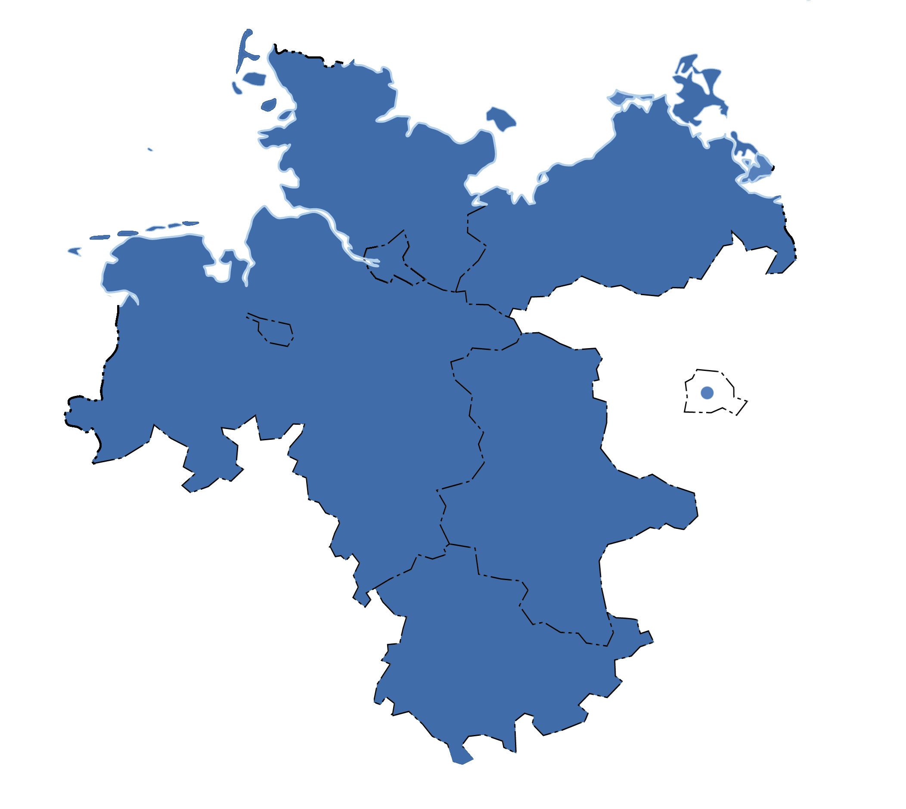
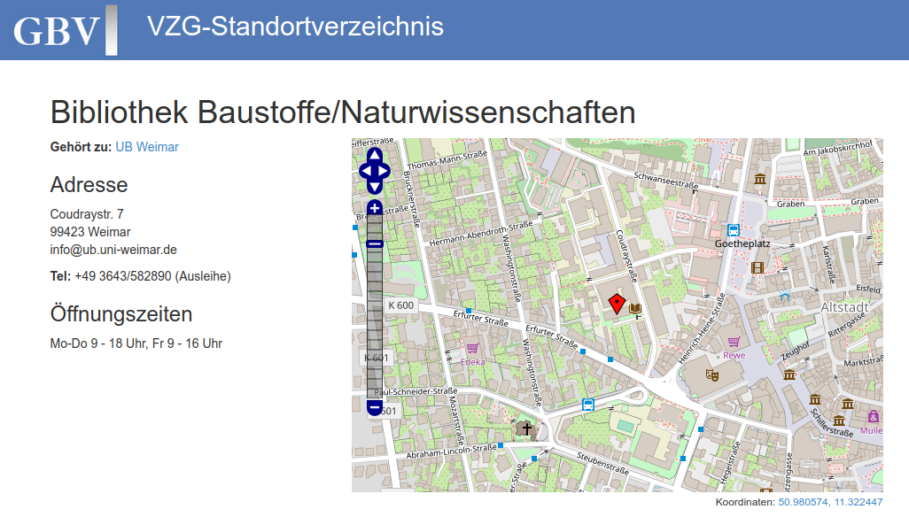

# Gemeinsamer Bibliotheksverbund (GBV)

{width=70%}

<!-- u.A. Thüringen und Sachsen-Anhalt -->

# Bibliothekskataloge

* VZG betreibt/koordiniert > 300 Bibliothekskataloge
* Vor allem Hochschulbibliotheken

\vspace{1em}

* Gemeinsamer Verbundkatalog (GVK)\
  [`http://uri.gbv.de/database/`*`gvk`*](http://uri.gbv.de/database/gvk)

\vspace{1em}

* Lokale Kataloge einzelner Bibliotheken (OPACs)\
  [`http://uri.gbv.de/database/`*`opac-de-...`*](http://uri.gbv.de/database/opac)

# Relevante Entitäten

            Beispiel-Identifier
----------- -------------------------------------------------
Bibliothek  `DE-Wim2` (ISIL der UB Weimar)
Katalog     `opac-de-wim2` (Katalog-ID auf ISIL-Basis)
Standort    <http://uri.gbv.de/organization/isil/DE-Wim2@bst>
Dokument    (`ppn:`)`826687091`
Exemplar    ...

URI-Präfixe (`http://uri.gbv.de/...`) teilweise optional.

# Schnittstellen und Formate

* [Document Availability Information API (DAIA)](http://purl.org/NET/DAIA):\
  Exemplare, Verfügbarkeiten, Standorte

* [CSL-API]\:\
  formatierte Literaturangaben

* [SRU]\:\
  vollständige Metadaten

* Linked Open Data (RDF)

# Document Availability Information API (DAIA)

Katalog + Dokument  $\Rightarrow$

* Exemplare mit Verfügbarkeiten und Standorten
* JSON-Format

Siehe [DAIA-Spezifikation](http://purl.org/NET/DAIA),
[Projektseite](https://verbundwiki.gbv.de/display/VZG/DAIA) und
[Wikipedia](https://de.wikipedia.org/wiki/Document_Availability_Information_API).

<https://verbundwiki.gbv.de/display/VZG/DAIA>

\small\vfill

~~~
https://paia.gbv.de/DE-Wim2/daia
  ?id=ppn:826687091
  &format=json
~~~

# Citation Style Language (CSL) API

Katalog + CQL-Query + Zitierstil $\Rightarrow$

* Formatierte Literaturangaben
* JSON-Format
* auch Dokument-Identifier für anschließende Abfrage per DAIA

\small\vfill

~~~
http://ws.gbv.de/csl/
  ?database=opac-de-27
  &query=pica.per=marx,karl
  &citationstyle=ieee
  &language=de
~~~

# CQL-Abfragen

------------------------------- -----------------------
`pica.per=Nachname,Vorname...`  Person
`pica.ppn=885600452`            bestimmtes Dokument
`pica.isn=3-9547618-6-6`        ISBN 
`pica.gnd=4549405-8`            GND-ID (Person, Thema)
...
------------------------------- -----------------------

* Suchschlüssel ("IKT") wie im OPAC
* Mehrere Bedingungen kombinierbar

# SRU

Bibliothek + CQL-Query $\Rightarrow$ Dokumente

* Metadaten in verschiedenen XML-Formate

\small\vfill

~~~
http://sru.gbv.de/opac-de-27
 ?version=1.1&operation=searchRetrieve
 &query=pica.per=marx,karl
 &maximumRecords=10
 &recordSchema=mods
~~~

# MODS-Format

XML-Format mit bibliographischen Daten

\small

~~~xml
<name type="personal" usage="primary" 
      authority="gnd" authorityURI="http://d-nb.info/gnd/" 
      valueURI="http://d-nb.info/gnd/118578537">
  <namePart type="family">Marx</namePart>
  <namePart type="given">Karl</namePart>
  <role>
    <roleTerm authority="marcrelator" type="code">aut</roleTerm>
  </role>
</name>
~~~

PPN steht in `/record/recordIdentifier[@source="DE-601"]`:

~~~
<recordIdentifier source="DE-601">899009921</recordIdentifier>
~~~

# Linked Open Data: Angaben zu Standorten/Bibliotheken

{width=95%}

# Bibliotheken und API-Endpunkte

* Alle Hochschulbibliotheken in Thüringen und Sachsen-Anhalt
  (Sachsen leider bislang nur eingeschränkt)

* <https://github.com/gbv/cdvost2018>\
  siehe Tabelle (`libraries.csv`)

# Hinweise und Ideen

* Verknüpfung mit anderen Datensätzen über

    * Dokumente (ISIL+PPN)
    * Autoren und Themen (GND)!
        * Suche u.A. bei <http://lobid.org/gnd>
    * ...

* Anzeige von Literaturangaben ([CSL-API])

* Anzeige von Standorten und Verfügbarkeit ([DAIA])

\vfill

*Bitte Nachfragen! <jakob.voss@gbv.de>*

[MODS]: http://www.loc.gov/standards/mods/
[DAIA]: http://purl.org/NET/DAIA
[CSL-API]: http://ws.gbv.de/csl/
